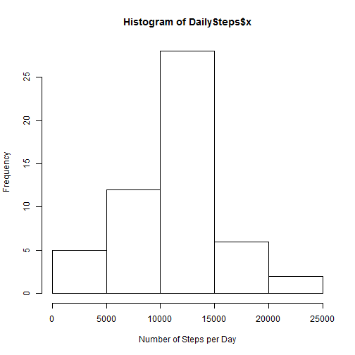
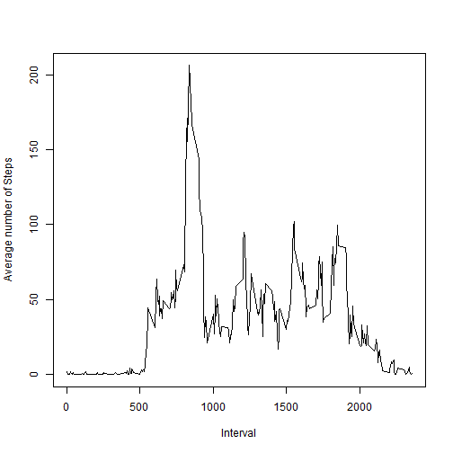
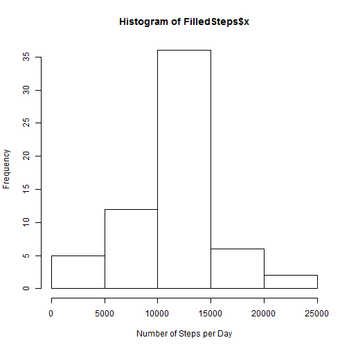
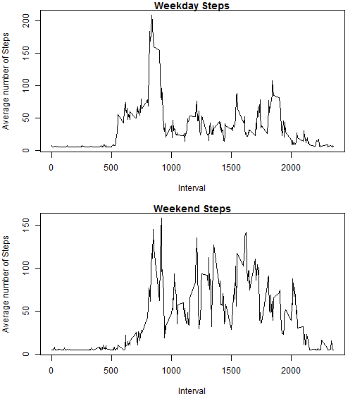

**(part 0) Loading and Processing Data**

The first step is to load the data and remove any missing values:

```r
data <- read.csv(paste("repdata-data-activity", "activity.csv", sep = "/"), header = T)

ActivityData <- data[complete.cases(data),]
```

**(part 1) What is Mean Total Number of Steps Taken per Day**

The code below calculates the total steps per day.


```r
DailySteps <- aggregate(ActivityData$steps, list(date = ActivityData$date), sum)
hist(DailySteps$x, xlab = "Number of Steps per Day")
```

 

```r
Mean <- mean(DailySteps$x)
Median <- median(DailySteps$x)
Mean
```

```
## [1] 10766.19
```

```r
Median
```

```
## [1] 10765
```
The mean of the steps taken per day is1.0766189 &times; 10<sup>4</sup>. The median of the steps taken per day is 10765.

**(part 2) What is The Average Daily Activity Pattern?**

This time we will take the data, find the average amount of steps taken on each interval for all of the days and plot them.


```r
DailyActs <- aggregate(ActivityData$steps, list(Interval = ActivityData$interval), mean)

plot(DailyActs$Interval, DailyActs$x, type = "l", xlab = "Interval", ylab = "Average number of Steps")
```

 

```r
BestInterval <- DailyActs[which(max(DailyActs$x) == DailyActs$x),"Interval"]
```
The 5-minute interval that contains the maximum number of steps on average across all days is the 835 interval.

**(part 3) Input Missing Values**
Here we calculate the rows with an NA value in the original data. Then we replace the NA with a mean of all steps in any interval and observe how this action changes the median and mean of the data

```r
Missing <- nrow(data[which(is.na(data)),])
Missing
```

```
## [1] 2304
```

```r
Replacer <- mean(DailyActs$x)

FilledData <- data
FilledData[is.na(FilledData)] <- Replacer

FilledSteps <- aggregate(FilledData$steps, list(date = FilledData$date), sum)

hist(FilledSteps$x, xlab = "Number of Steps per Day")
```

 

```r
FilledMean <- mean(FilledSteps$x)
FilledMedian <- median(FilledSteps$x)
FilledMean
```

```
## [1] 10766.19
```

```r
FilledMedian
```

```
## [1] 10766.19
```
The new mean is the same as the old mean, but the median is slightly different, because the act of including averages in a median calculation changes the median from an integer to a decimal.


**(part 4) Are There Differences in Activity Patterns between Weekdays and Weekends?**

Finally, we will separate the data into weekdays and weekends and compare the average amount of steps taken at any interval on the weekdays and weekends


```r
weekDay <- weekdays(as.Date(FilledData$date))

weekDay[grep("Monday", weekDay)] <- "weekday"
weekDay[grep("Tuesday", weekDay)] <- "weekday"
weekDay[grep("Wednesday", weekDay)] <- "weekday"
weekDay[grep("Thursday", weekDay)] <- "weekday"
weekDay[grep("Friday", weekDay)] <- "weekday"
weekDay[grep("Saturday", weekDay)] <- "weekend"
weekDay[grep("Sunday", weekDay)] <- "weekend"

weekPart <- factor(weekDay, levels= c("weekday", "weekend"))
FinalData <- cbind(FilledData, weekPart)


Weekday_Workout <- FinalData[which(weekPart == "weekday"),]
Weekend_Workout <- FinalData[which(weekPart == "weekend"),]

weekdayActs <- aggregate(Weekday_Workout$steps, list(Interval = Weekday_Workout$interval), mean)
weekendActs <- aggregate(Weekend_Workout$steps, list(Interval = Weekend_Workout$interval), mean)
```

```r
par(mfcol = c(2,1))
par(mar = c(5,4,1,1))
plot(weekdayActs$Interval, weekdayActs$x, type = "l", main= "Weekday Steps", xlab = "Interval", ylab = "Average number of Steps")
plot(weekendActs$Interval, weekendActs$x, type = "l", main = "Weekend Steps", xlab = "Interval", ylab = "Average number of Steps")
```

 


